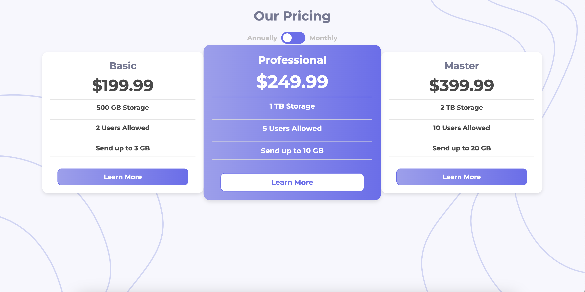

# Frontend Mentor - Pricing component with toggle solution

This is a solution to the [Pricing component with toggle challenge on Frontend Mentor](https://www.frontendmentor.io/challenges/pricing-component-with-toggle-8vPwRMIC). Frontend Mentor challenges help you improve your coding skills by building realistic projects. 

### Screenshot

### Links

- Solution URL: [https://github.com/nj93777/pricing-component-with-toggle-master]
- Live Site URL: [https://nj93777.github.io/pricing-component-with-toggle-master/]

### Built with

- Semantic HTML5 markup
- CSS custom properties
- Flexbox
- Mobile first workflow

